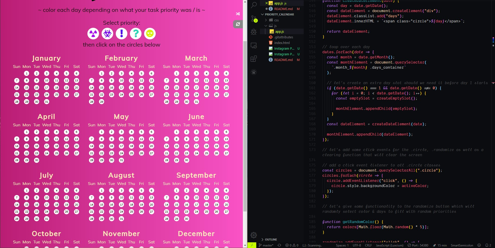

# Hi guys 👋, I created this following the guide provided by **[moods calendar](https://tinyurl.com/mood-calendar)** - Florin Pop as part of the #100Days100Projects and made it my own.

---

## Project Thumbnail:

---

# Hope you enjoy, as I had fun with the Javascript. 😁

`Still in progress`

# If you like this project then follow me here =>

- Twitter - https://twitter.com/MadbotD
- Instagram - https://www.instagram.com/madbot_designs/
- Stack Overflow - https://stackoverflow.com/story/maddyb
- Codepen - https://codepen.io/dashboard/

---

Cheers 👍🏼
